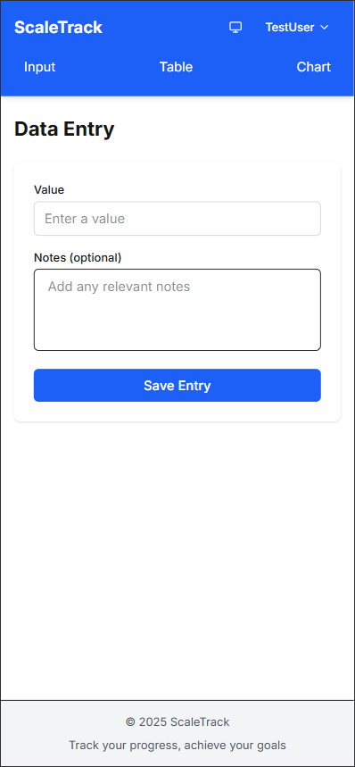
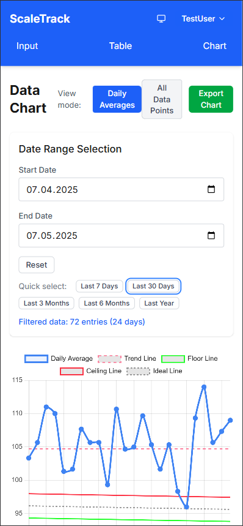
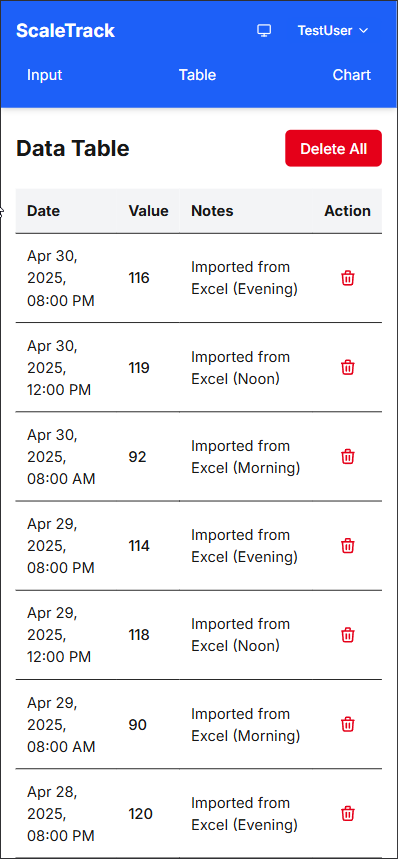
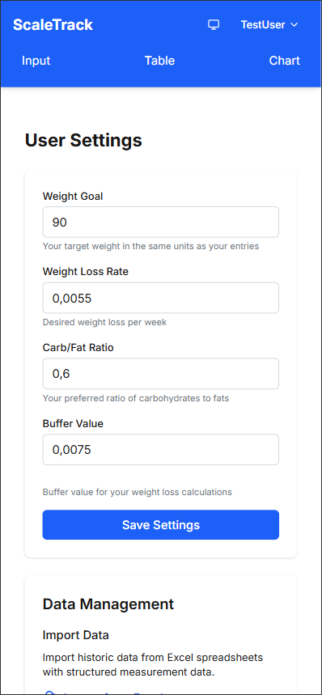
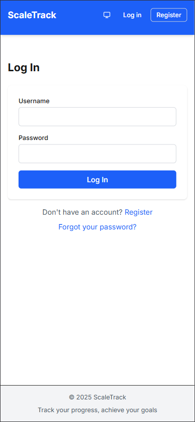
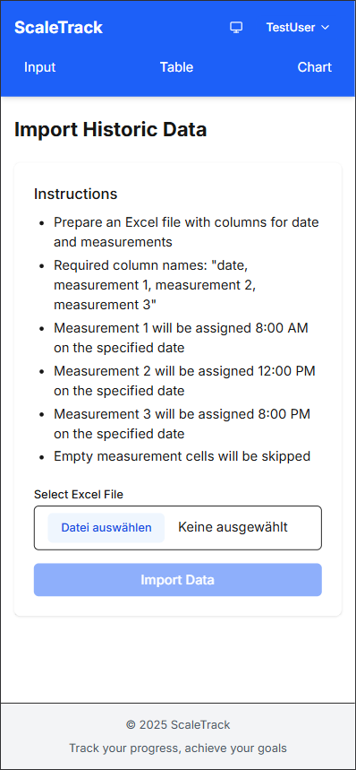

# ScaleTrack

A mobile-optimized web application for tracking and visualizing weight data with secure user authentication.

## Table of Contents
- [About](#about)
  - [Who Is This For?](#who-is-this-for)
- [Features](#features)
- [Screenshots](#screenshots)
- [Technologies](#technologies)
- [Project Structure](#project-structure)
- [Deployment Instructions](#deployment-instructions)
  - [Prerequisites](#prerequisites)
  - [Docker Deployment](#docker-deployment)
- [Environment Variables](#environment-variables)
  - [Environment Variable Descriptions](#environment-variable-descriptions)
- [Development Instructions](#development-instructions)
  - [Local Development Setup](#local-development-setup)
  - [Database Management](#database-management)
- [Data Import/Export](#data-importexport)
- [API Reference](#api-reference)
- [Roadmap](#roadmap)
- [Contributing](#contributing)
- [License](#license)

## About

ScaleTrack is designed for individuals who want to monitor their weight changes over time. The application provides an intuitive interface for recording weight measurements, viewing historical data in a table, and visualizing trends through interactive charts.

### Who is this for?

ScaleTrack is designed for:
- **Health-conscious individuals** tracking their weight as part of a fitness journey
- **People with specific health goals** who need to monitor weight fluctuations
- **Fitness coaches** who want a simple tool to track client progress
- **Anyone interested** in logging and analyzing their weight data over time

Currently, deployment requires basic knowledge of Docker and Docker Compose as the project is in an early development stage.

## Features

- **User Authentication**: Secure multi-user system with registration and login
- **Password Recovery**: Self-service password reset via email
- **Mobile-optimized UI**: Responsive design works great on smartphones and tablets
- **Data Input**: Simple form for recording weight values with optional notes
- **Data Visualization**: Interactive chart showing weight trends over time with floor/ceiling guidelines
- **Data Table**: Comprehensive table view of all recorded entries
- **Secure Data Storage**: Each user can only access their own data
- **Data Filtering**: Filter chart data by date ranges
- **Data Export**: Export chart visualizations as images
- **Data Import**: Import weight data from Excel files (see [Import/Export](#data-importexport) section)
- **Dark Mode**: Support for light and dark themes
- **User Settings**: Customize application behavior and display preferences

## Screenshots

<table>
  <tr>
    <td width="50%"><br><em>Home Screen - Weight Input</em></td>
    <td width="50%"><br><em>Chart Visualization</em></td>
  </tr>
  <tr>
    <td width="50%"><br><em>Data Table View</em></td>
    <td width="50%"><br><em>User Settings</em></td>
  </tr>
  <tr>
    <td width="50%"><br><em>Login Screen</em></td>
    <td width="50%"><br><em>Excel Data Import</em></td>
  </tr>
</table>

## Technologies

- **Frontend**: Next.js 14+ with TypeScript and Tailwind CSS
- **Database**: SQLite with Prisma ORM
- **Authentication**: NextAuth.js for secure user management
- **Visualization**: Chart.js with react-chartjs-2
- **API**: Next.js API Routes
- **Containerization**: Docker support for easy deployment

## Deployment Instructions

### Prerequisites

- Docker and Docker Compose
- Git
- SMTP server details (for password reset functionality)

### Docker Deployment

1. Clone the repository:
   ```bash
   git clone https://github.com/BadWinniePooh/weight-tracking.git
   cd weight-tracking
   ```

2. Create and configure the `.env` file according to the [environment variables section](#environment-variables)

3. Adjust the [docker compose yaml](./compose.yaml) to your needs (add labels for traefik, etc.)

4. Build and run the container:
   ```bash
   docker-compose up -d --build
   ```

5. Access the application at http://localhost:3000 (or your configured domain)

6. To stop the container:
   ```bash
   docker-compose down
   ```

## Environment Variables

Create a `.env` file in the root directory with the following variables:

```
NODE_ENV=production

# Database configuration
## Default development path:
# DATABASE_URL="file:./prisma/dev.db?connection_limit=1"
## Default production path:
DATABASE_URL="file:/app/data/weight-tracking.db"

# NextAuth.js configuration
NEXTAUTH_SECRET=your-nextauth-secret-key-change-in-production
NEXTAUTH_URL=http://localhost:3000

# Email configuration (for password reset)
EMAIL_SERVER_HOST=smtp.example.com
EMAIL_SERVER_PORT=587
EMAIL_SERVER_USER=your-email@example.com
EMAIL_SERVER_PASSWORD=your-email-password
EMAIL_FROM=noreply@example.com
EMAIL_SERVER_SECURE=false

# Timezone configuration
# Use IANA timezone names: Europe/Berlin for Germany (MEZ/CET)
TIMEZONE="Europe/Berlin"
```

### Environment Variable Descriptions

- **NODE_ENV**: Sets application environment (production/development)
- **DATABASE_URL**: Connection string for your database ([Prisma](https://prisma.io) by default)
- **NEXTAUTH_SECRET**: A random string used to encrypt cookies and tokens (use a secure random generator)
- **NEXTAUTH_URL**: The base URL of your deployed application
- **EMAIL_SERVER_***: SMTP settings for sending password reset emails
- **EMAIL_FROM**: The "from" address for outgoing emails
- **EMAIL_SERVER_SECURE**: TLS setting for connection security (check with your provider whether TLS (true) is used)
- **TIMEZONE**: Default timezone for date calculations and display

## Development Instructions

### Local Development Setup

1. Clone the repository:
   ```bash
   git clone https://github.com/BadWinniePooh/weight-tracking.git
   cd weight-tracking
   ```

2. Install dependencies:
   ```bash
   npm install
   ```

3. Create a `.env.local` file based on the example above, using:
   ```
   DATABASE_URL="file:./prisma/dev.db?connection_limit=1"
   NEXTAUTH_SECRET=any-random-string-for-development
   NEXTAUTH_URL=http://localhost:3000
   ```

4. Set up the database:
   ```bash
   npx prisma migrate dev
   ```

5. Start the development server:
   ```bash
   npm run dev
   ```

6. Open [http://localhost:3000](http://localhost:3000) in your browser

### Database Management

- View your database with Prisma Studio:
  ```bash
  npx prisma studio
  ```

- Create a migration after schema changes:
  ```bash
  npx prisma migrate dev --name your_migration_name
  ```

- Reset database (deletes all data):
  ```bash
  npx prisma migrate reset
  ```

## Data Import/Export

### Importing Data

ScaleTrack allows you to import weight data from Excel files:

1. Navigate to the Import page (`/import`)
2. Upload an Excel file (.xlsx) containing your weight data
3. The system expects columns for date and weight measurements (up to 3 per day) with one line for headers

#### Example Table for reference

| date | measurement 1 | measurement 2 | measurement 3 |
| --- | --- | --- | --- |
| 11.08.2024 | 102.4 | | 104.4 |
| 12.08.2024 | ... | ... | ... |

### Exporting Data

You can export your data in the following formats:

1. **Chart Export**: From the Chart page, use the export button to save the visualization as a PNG image

## Roadmap

Future development plans include in no particular order:

- Add image upload of scale (7 segment display) as alternative input method
- Docker image published to docker hub
- Table export to CSV/Excel
- Multi-language support
- Design improvements

## Contributing

1. Fork the repository
2. Create a feature branch: `git checkout -b feature/amazing-feature`
3. Commit your changes: `git commit -m 'Add amazing feature'`
4. Push to the branch: `git push origin feature/amazing-feature`
5. Open a Pull Request

## License

This project is licensed under the MIT License - see the LICENSE file for details.
